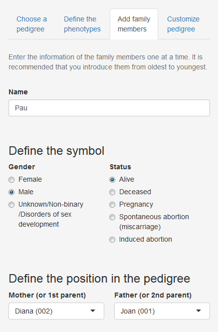

## General Information

---

 

### What is PhenTree?

PhenTree is a completely free web application to generate pedigrees from a genetic point of view. Its purpose is to help clinical geneticist and researchers to represent the family history of patients to better diagnose a disease, calculate risks for individuals, represent case studies in scientific publications, and many other uses. 

PhenTree follows the Standardized Human Pedigree Nomenclature defined by the National Society of Genetic Counselors on 1995 [1].

 

### How was PhenTree created?

PhenTree is based in R programming language and uses mainly two R packages:

* **kinship2**: created by Jason Sinnwell and Terry Therneau, offers functions to generate basic pedigree plots [2]. Some extra symbols and customization options were added to this R package. 
* **shiny**: offers functions to facilitate the creation of interactive web apps using R [3]. 

PhenTree also makes use of other R packages like **shinyjs** [4], **shinyalert** [5] and **colourpicker** [6] by Dean Attali, as well as other common R packages (**RMySQL** [7], **pool** [8] and **DT** [9]). Moreover, all this app information has been written using **markdown** [10]. 

 

### What are the steps to create a pedigree?

The following steps are only an example of the process to generate a pedigree. However, steps 4 to 7 can be performed in any order you like.

 

#### STEP 1: Register

Enter a username and a password of your choosing and click the *Sign in* button. Remember them well!! For now we do not offer any option to recover them.

 

#### STEP 2: Log in

Once you created a user account, you can log in with your username and your password.

 

#### STEP 3: Create a pedigree

Create a new pedigree by clicking at the *Create a new pedigree* button and entering a name for the pedigree. Once you have many pedigrees created, you can select the one you want to work with or delete the ones that you no longer need. 

 

#### STEP 4: Define the phenotypes

In the *Define the phenotypes* tab of the left panel (we'll call it **inputs panel**) you can select the phenotypes you would like to represent in the pedigree for this particular family. The names of the phenotypes and their IDs are the standards defined by the [Human Phenotype Ontology](https://hpo.jax.org/app/) [11]. You can select up to four. 

 

#### STEP 5: Add family members

In the *Add family members* tab of the inputs panel there is a form where you can add the information of every person of the family one at a time. Once you press *Submit*, a new row appears in the *Summary table* of the right panel (we'll call it **outputs panel**) with the information you introduced for that person. You can add as many family members as you like. 

 

You can edit, delete or change the order of the rows in the summary table at any time using the buttons above it. 

 

The recommendation is to introduce the members from oldest to youngest, although it is not obligatory. If you introduce a child before introducing their parents, you'll have to later edit the child's information to indicate who their parents are, which takes more time. 

The pedigree is automatically generated and updated with the information contained in the summary table and is shown in the *Pedigree* tab of the outputs panel. Under the pedigree you can also see a legend of the symbols and options to download the image. 

 

#### STEP 6: Customize your pedigree

In the *Customize pedigree* tab of the inputs panel there are many options to personalize the pedigree plot as you like. You can choose which information to add in the plot, the sizes, the colors and if you would like to view the legend or not. 

 

#### STEP 7: Get information about your phenotypes of interest

In the *Genes and diseases* tab of the outputs panel you can find, for every one of the phenotypes you selected, a table that contains the genes and the respective diseases that have been associated to this phenotype according to the Human Phenotype Ontology [11]. In the *Disease ID* column there is a link to the [Orphanet](https://www.orpha.net/consor/cgi-bin/index.php) [12] or the [Online Mendelian Inheritance in Man (OMIM)](https://www.omim.org/) [13] websites where you can find more information about every disease and the genes associated to it. You can also download these tables as a CSV file or Excel file. 

 
 

