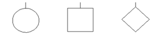

## Pedigree Symbols

---

 

The next table shows all the pedigree symbols included in PhenTree with their respective significance. Most of these symbols are included in the kinship2 R package [2]. Other symbols were added specially for this app to better follow the Standardized Human Pedigree Nomenclature defined by the National Society of Genetic Counselors [1]. 

 

| Symbols | Explanation |
| --- | --- |
|  | Woman (circle), man (square) and person of unknown sex, non-binary or with a disorder of sex development (diamond). |
|  | Person affected by one or several phenotypes of interest. |
|  | Carriers of a genetic mutation or alteration who are not expected to express the disease. |
|  | Presymptomatic carriers of a genetic mutation or alteration that do not express the disease at the moment but could express it in the future. |
|  | Several individuals represented with one symbol. You can indicate the concrete number or an "n" if the number is unknown. |
|  | The age or year of birth can be indicated under the symbol. |
|  | Deceased person. You can indicate below the age or the year of death. |
|  | Person who consults with the doctor (consultand) to get a diagnosis or a genetic counseling. |
|  | Individuals adopted inside the family (not biologically related). |
|  | Individuals who are biologically related but were adopted by another family. |
|  | Pregnancy. The weeks or months of gestation can be indicated below. |
|  | Spontaneous abortion or miscarriage (without the diagonal line) and induced abortion or termination of pregnancy (with the diagonal line). |
|  | Extra information can be added under the symbol like the name, the karyotype, the age or year of diagnosis of a disease, the cause of death, the result of a genetic test,... |
|  | Relationship lines between parents and children. |
|  | Marriage or couple without children. |
|  | Relationship between two consanguineous people. |
|  | Monozygotic (identical) twins. |
|  | Dizygotic (fraternal) twins. |
|  | Twins of unknown zygosity. |

 
 

